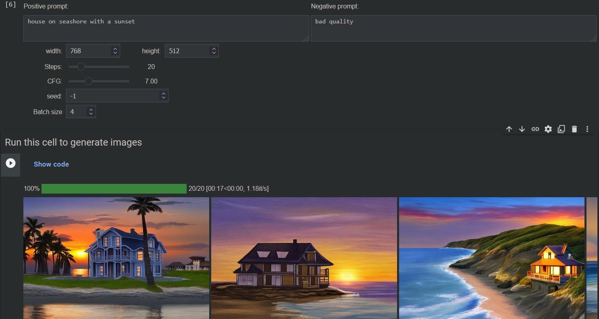

# Stable Diffusion with Colab UI

This repository aims to emulate WebUI using just Colab and IPython widgets, without running a web server. Since Google Colab prohibits running gradio WebUI, this may be a good alternative.

 
Note

I use diffusers library to run stable diffusion, which has some problems with importing models in Automatic1111 format. So it may take some work to load a particular model.

### Plans:
 - [X] UI based on IPython Widgets
 - [X] Load models from huggingface
 - [X] Index of popular huggingface models
 - [X] Change VAE and sampler
 - [X] Load textual inversions
 - [x] Load models in Automatic1111 (ckpt/safetensors) format
 - [x] Load LoRAs
 - [ ] Img2Img
 - [ ] Image mixing
 - [ ] Inpainting

## Kandinsky

Colab UI for Kandinsky txt2img and image mixing.

Original repo: https://github.com/ai-forever/Kandinsky-2
